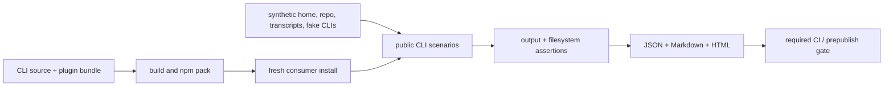

# Dogfood evidence — technical design

**Status:** Implemented and validated
**Date:** 2026-07-18
**Product spec:** [PRODUCT.md](./PRODUCT.md)
**Research baseline:** `7d9575ffc45dac9e24fe095aac5220e5768c20bf`

## Context

The npm package already builds an executable and runs a version-only smoke test,
while CI separately rebuilds and version-checks the committed plugin bundle.
The command layer has an injectable `home` seam, but the installed entry point
does not expose it and several stateful dispatch branches do not forward it.
That makes an honest subprocess-level isolated run impossible today.

- [`cli/package.json @ 7d9575f`](https://github.com/elliot-ylambda/gradient/blob/7d9575ffc45dac9e24fe095aac5220e5768c20bf/cli/package.json) — build, smoke, test, and publish lifecycle.
- [`cli/src/bin.ts:28 @ 7d9575f`](https://github.com/elliot-ylambda/gradient/blob/7d9575ffc45dac9e24fe095aac5220e5768c20bf/cli/src/bin.ts#L28) — installed binary and latency-sensitive hook dispatch.
- [`cli/src/cli.ts:215 @ 7d9575f`](https://github.com/elliot-ylambda/gradient/blob/7d9575ffc45dac9e24fe095aac5220e5768c20bf/cli/src/cli.ts#L215) — public command dispatcher and current `io.home` seam.
- [`cli/src/config.ts:46 @ 7d9575f`](https://github.com/elliot-ylambda/gradient/blob/7d9575ffc45dac9e24fe095aac5220e5768c20bf/cli/src/config.ts#L46) — home-relative configuration and per-project cache paths.
- [`cli/scripts/smoke-bin.mjs @ 7d9575f`](https://github.com/elliot-ylambda/gradient/blob/7d9575ffc45dac9e24fe095aac5220e5768c20bf/cli/scripts/smoke-bin.mjs) — existing packaged-binary version assertion.
- [`.github/workflows/ci.yml @ 7d9575f`](https://github.com/elliot-ylambda/gradient/blob/7d9575ffc45dac9e24fe095aac5220e5768c20bf/.github/workflows/ci.yml) — required CLI, repository, and plugin jobs.

Unit and integration tests remain the fastest proof for individual branches.
This change adds the missing composition layer: subprocesses, the packed
artifact, real filesystem writes, and inspectable release evidence.

## End-to-end flow

## Proposed changes

### Installed-state isolation

- Add a small resolver in `cli/src/bin.ts` that maps non-empty
  `GRADIENT_HOME` to an absolute path and passes it as `BinaryIo.home` when the
  module is the installed entry point.
- Thread `io.home` through every stateful branch in `cli/src/cli.ts`: init,
  remove, migrate, recall, stats, insights, recap, continuity, bundle,
  checkpoint, autopilot, and respond, in addition to the branches that already
  forward it.
- Keep the environment variable absent by default, preserving all current path
  behavior. Add focused unit tests for resolution and dispatch forwarding.

### Packaged dogfood runner

- Add `cli/scripts/dogfood.mjs`, implemented with Node built-ins only. It owns a
  temporary sandbox, builds a tarball with lifecycle scripts disabled, installs
  it into a fresh consumer, invokes `dist/bin.js` with `process.execPath`, and
  removes the sandbox unless `--keep` is set.
- Derive the production dependency directories from lockfile v3 and pass them
  as explicit `--install-links` inputs beside the candidate tarball. Install
  with `--offline` into an empty task-local npm cache, then assert each package
  is a copied directory. This prevents a warm contributor cache from masking a
  clean-runner failure without importing or symlinking the source checkout.
- Override npm's inherited dry-run setting only for the disposable pack/install
  children. This makes `npm publish --dry-run` execute a real local composition
  gate even though the outer publication remains a simulation.
- Generate all fixtures at runtime. Claude JSONL is placed under the encoded
  project history root and Codex rollout JSONL under its session root. Fake
  `claude` and `codex` executables implement the actual stdin/stdout protocols,
  return deterministic classification and judge JSON, and expose no tools.
- A scenario wrapper records subprocesses and assertions while allowing later
  independent scenarios to continue after a failure. Setup failure marks
  dependent cases skipped. Output is capped and sandbox/home paths are replaced
  before storage.
- Compute cache locations with the public on-disk contract (canonical project
  path plus the 24-character SHA-256 prefix), allowing validated synthetic
  suggestions to enter through the same private cache the CLI consumes.
- Maintain an explicit `coveredCommands` map. Parse the installed help text into
  its public command set and require that set to be covered as an early
  scenario; the map may additionally cover intentionally non-advertised hook
  targets.

### Scenario groups

1. Distribution: pack/install, version/help, executable mode, bundled skill,
   and plugin binary parity (PRODUCT 2, 6–7).
2. Setup and mining: dual-target init, both transcript formats, Claude-backed
   and Codex-backed scans, user scope, review JSON, explain, and session-start
   (PRODUCT 5, 8–9).
3. Artifact lifecycle: legacy command plus migration, then the full validated
   suggestion matrix applied through the installed CLI, interactive review,
   list, settings inspection, project-playbook pinning, bundle, remove, and
   tamper refusal (PRODUCT 9–11, 13, 15).
4. Runtime features: recall, adoption, stats, insights HTML, continuity,
   checkpoint/recap, board session discovery and change-only refresh, autopilot
   judge, notify, and hook contracts
   (PRODUCT 12–13).
5. Failure directions: malformed/corrupt/oversized/symlinked inputs, unknown
   command, disabled hook export, and provenance-protected removal
   (PRODUCT 14).

The runner will prefer semantic assertions (parsed JSON, manifest entries,
settings tuples, markers, modes, and round-trip absence) over brittle full
stdout snapshots.

### Evidence and integration

- Render one normalized in-memory report into `report.json`, `report.md`, and
  self-contained escaped `report.html`. Include the git commit when available,
  package metadata, tarball SHA-256, runtime metadata, limitations, case
  commands/assertions/output, and totals (PRODUCT 16–19, 22).
- Add `npm run dogfood`; make `prepublishOnly` run the built runner after unit,
  build, and binary smoke checks.
- Run the dogfood command inside the existing required `plugin` CI job after
  rebuilding the plugin. Upload the evidence directory with `if: always()` so a
  failed gate remains inspectable (PRODUCT 20).
- Add `docs/dogfood.md` with the automated command, report interpretation, and
  opt-in live checklist. Link it from the README (PRODUCT 21–22).

## Testing and validation

- Unit tests for `GRADIENT_HOME` normalization and entry-point forwarding cover
  PRODUCT 3–4 without spawning a process.
- Existing CLI tests plus new dispatch assertions verify that every relevant
  command receives the injected home (PRODUCT 4).
- The dogfood runner itself is the integration test for PRODUCT 2 and 5–19. A
  local run must pass from a clean checkout and its JSON case count must equal
  the Markdown and HTML totals.
- `npm test`, `npm run typecheck`, `npm run build`, `npm run smoke:bin`,
  `npm run build:plugin`, and `npm run dogfood` validate the complete change.
- `git diff --exit-code plugin/.claude-plugin/plugin.json plugin/bin/gradient.mjs`
  verifies the committed plugin was regenerated after entry-point changes.
- Inspect a generated Markdown and HTML report for readable command evidence,
  sanitized paths, explicit synthetic limitations, and no fixture secret
  sentinel.
- Execute the live checklist only with explicit operator consent; record it as
  separate evidence and never make its absence look like an automated pass.

## Risks and mitigations

- **Runner tests its own fixtures instead of reality.** Help-derived command
  coverage, public subprocess invocation, packed installation, and semantic
  filesystem assertions reduce false confidence; the live checklist names the
  remaining gap.
- **Nondeterministic local tools or network access.** Child PATH prioritizes
  deterministic stand-ins, npm installation uses the local tarball with scripts,
  audit, and funding calls disabled, and no network-dependent command is run.
- **Evidence leaks host paths or secrets.** Fixtures are synthetic; output is
  bounded and normalized; reports fail a sentinel scan before they are accepted.
- **A setup failure causes misleading cascades.** Cases carry prerequisites and
  report skipped dependents distinctly from passes.
- **The release lifecycle recurses through `npm pack`.** The runner invokes pack
  with lifecycle scripts disabled, so running it from `prepublishOnly` cannot
  recursively invoke itself; it also cancels the outer npm dry-run flag for the
  disposable child pack/install so the gate cannot pass without an artifact.

## Parallelization

Parallel agents are not used for implementation. The home seam, runner fixture
contracts, report schema, and CI lifecycle are tightly coupled, and the active
repository instructions reserve sub-agents for explicitly requested delegation.
The runner may execute independent read-only assertions concurrently only where
that cannot race on its synthetic project state; mutation scenarios remain
sequential by design.
